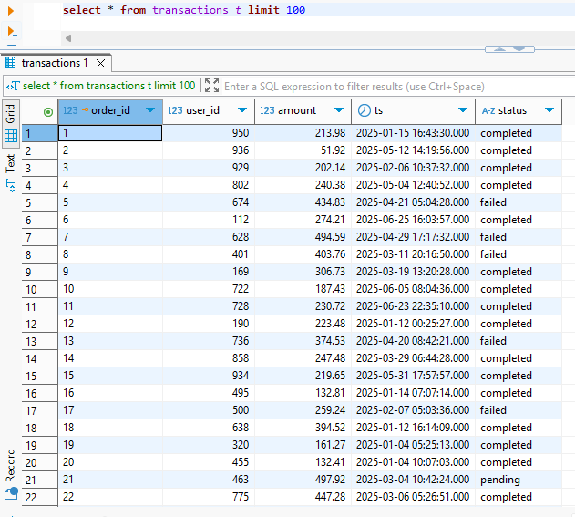
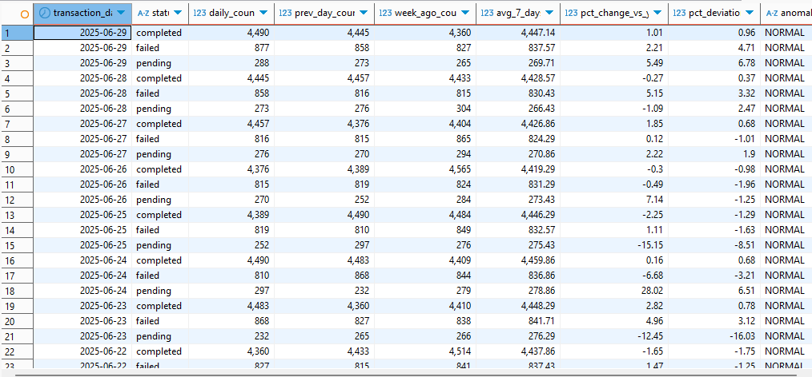
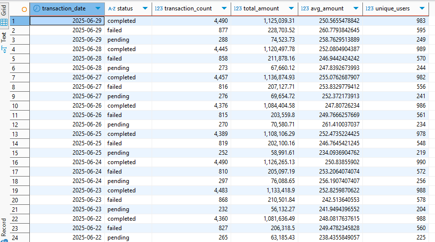

# Proyecto de Orquestación de Datos con Airflow y Docker

Este proyecto implementa un entorno completo de Apache Airflow utilizando Docker Compose. Está diseñado para orquestar flujos de trabajo de datos (ETL/ELT), incluyendo la carga de datos desde archivos CSV, su validación y almacenamiento en una base de datos PostgreSQL.

## Requisitos Previos

-   **Docker**: [Instrucciones de instalación](https://docs.docker.com/get-docker/)
-   **Docker Compose**: Generalmente se incluye con la instalación de Docker Desktop.

## Configuración Inicial

1.  **Clonar el repositorio**:
    ```bash
    git clone <URL_DEL_REPOSITORIO>
    cd data_enginieer_tecnical_test
    ```

2.  **Crear el archivo de entorno**:
    Copia el archivo de ejemplo `.env.example` para crear tu propio archivo de configuración `.env`. Este archivo es crucial ya que `docker-compose` lo utiliza para configurar las variables de entorno de los contenedores.

    *En Linux o macOS:*
    ```bash
    cp .env.example .env
    ```
    *En Windows (Command Prompt):*
    ```cmd
    copy .env.example .env
    ```

## Especificaciones de los Contenedores

El archivo `docker-compose.yml` define y orquesta los siguientes servicios:

-   `postgres`: Un contenedor que ejecuta una base de datos **PostgreSQL 13**. Actúa como el backend de metadatos para Airflow y almacena los datos procesados. Sus datos persisten gracias a un volumen de Docker (`postgres-db-volume`).
-   `airflow-webserver`: Expone la interfaz de usuario de Airflow. Puedes acceder a ella desde tu navegador en `http://localhost:8080`.
-   `airflow-scheduler`: Es el corazón de Airflow. Este servicio se encarga de monitorear los DAGs y disparar las tareas según su planificación.
-   `airflow-init`: Un servicio de inicialización que se ejecuta una sola vez para preparar la base de datos y crear el usuario administrador por defecto (`admin`/`admin`).

Todos los servicios de Airflow se construyen a partir de una imagen local (`airflow-local:latest`), lo que garantiza que todas las dependencias y configuraciones del proyecto estén encapsuladas.

## Ejecución del Entorno

Para construir la imagen de Docker y levantar todos los servicios en segundo plano, ejecuta el siguiente comando desde la raíz del proyecto:

```bash
docker-compose up --build -d
```

Una vez que los contenedores estén en funcionamiento, podrás acceder a la interfaz de Airflow en **http://localhost:8080** (usuario: `admin`, contraseña: `admin`).


# 1. DAG_load_sample_transactions

## Descripción

Dentro de app/dags/, se encuentra un DAG llamado `load_sample_transactions.py`. Este DAG implementa un pipeline end-to-end para procesar transacciones de muestra desde un archivo CSV (1 millón de filas) hasta una base de datos, con validaciones, reintentos y monitoreo integrado.

## Funcionalidades

El workflow ejecuta las siguientes operaciones de forma secuencial:

1. **Validación de CSV**: Verifica la existencia del archivo `sample_transactions.csv` local y valida que tenga el tamaño mínimo requerido usando Polars
2. **Test de conexión a base de datos**: Establece y verifica la conectividad con PostgreSQL
3. **Gestión de tabla**: Verifica si la tabla `transactions` existe, la crea si es necesario, y reporta su estado actual
4. **Carga de datos**: Lee el CSV completo con Polars e inserta los datos en PostgreSQL con manejo de conflictos.

## Arquitectura del Pipeline


## Características Implementadas

### Robustez y Confiabilidad
- ✅ **Reintentos automáticos**: Configuración de 1 reintento con delay de 5 minutos
- ✅ **Validaciones**: Verificación de existencia de archivo y tamaño mínimo (1KB por defecto)
- ✅ **Gestión de tabla**: Creación automática de tabla si no existe
- ✅ **Manejo de duplicados**: Inserción con `ON CONFLICT DO NOTHING` para evitar duplicados
- ✅ **Logging detallado**: Registro completo de operaciones y errores

### Eficiencia y Rendimiento
- ✅ **Polars para lectura**: Uso de Polars para procesamiento eficiente de CSV
- ✅ **Conexiones optimizadas**: Gestión apropiada de conexiones PostgreSQL con psycopg2
- ✅ **Inserción row-by-row**: Control granular de inserción con contador de filas

### Configuración y Mantenimiento
- ✅ **DAG configurado**: Ejecución manual, sin catch-up, máximo 1 ejecución concurrente
- ✅ **Documentación**: Cada tarea documentada con markdown
- ✅ **Tags organizados**: Etiquetas para fácil filtrado y búsqueda
- ✅ **Estructura modular**: Funciones separadas y reutilizables


## Configuración y Uso

### Configuración de Base de Datos
Deben usarse las variables configuradas en las variables de entorno archivo .env
```python
# Configuración PostgreSQL (hardcoded en el DAG)
POSTGRES_CONFIG = {
    'dbname': 'airflow',
    'user': 'airflow', 
    'password': 'airflow',
    'host': 'postgres',
    'port': '5432'
}
```
Nota: En caso de querer hacer la conexion mediante otra herramienta (Heidydb, Dbeaver..) de debe usar en el host: localhost


### Archivo de Datos
En caso de querer hacer pruebas es necesario en app/data/local agregar el archivo sample_transactions.csv no se sube a github por cuestiones de tamaño.
- **Ubicación**: `/app/data/local/sample_transactions.csv`
- **Formato esperado**: CSV con columnas: `order_id`, `user_id`, `amount`, `ts`, `status`
- **Validación**: Tamaño mínimo 1KB por defecto

### Ejecutar el DAG
```bash
# Activar el DAG
airflow dags unpause load_sample_transactions

# Ejecutar manualmente (configurado solo para trigger manual)
airflow dags trigger load_sample_transactions
```

## Métricas y Monitoreo

El DAG registra las siguientes métricas por tarea:
- Tiempo de ejecución
- Memoria utilizada
- Número de registros procesados
- Tasa de errores/reintentos
- Tamaño de archivos procesados

## Datos Cargados en la base de Datos




# 2: SQL y Análisis de Datos

## Descripción

En app/sql/, se encuentra el módulo que implementa un conjunto completo de consultas SQL, vistas, índices y triggers para análisis avanzado de transacciones, detección de anomalías y monitoreo de usuarios con comportamiento sospechoso.

## Funcionalidades Implementadas

### 1. Análisis Diario y Resúmenes
- **Vista resumen diaria**: Agregaciones por fecha y estado con métricas clave
- **Detección de anomalías**: Análisis de tendencias con alertas automáticas por incrementos significativos
- **Monitoreo de usuarios**: Identificación de usuarios con múltiples transacciones fallidas

### 2. Optimización de Rendimiento
- **Índices estratégicos**: Optimización de consultas por fecha y estado
- **Triggers de validación**: Prevención de datos fuera de rango automática

## Componentes Detallados

### 📊 Vista: daily_transaction_summary
**Archivo**: `daily_transaction_summary.sql`

Proporciona un resumen diario de transacciones con métricas agregadas por estado.

```sql
-- Métricas incluidas:
- transaction_date: Fecha de la transacción
- status: Estado de la transacción  
- transaction_count: Número total de transacciones
- total_amount: Suma total de montos
- avg_amount: Promedio de montos
- unique_users: Usuarios únicos por día/estado
```

### 🚨 Vista: daily_anomaly_detection
**Archivo**: `daily_anomaly_detection.sql`

Sistema avanzado de detección de anomalías con análisis de tendencias y alertas automáticas.

**Características principales:**
- **Análisis temporal**: Comparación con día anterior y semana anterior
- **Promedio móvil**: Cálculo de promedio de 7 días
- **Alertas graduales**: 
  - `HIGH_ANOMALY`: >150% del promedio
  - `MODERATE_ANOMALY`: >110% del promedio  
  - `LOW_ANOMALY`: <80% del promedio
  - `NORMAL`: Dentro de rangos esperados

**Métricas calculadas:**
- Cambio porcentual vs. día anterior
- Desviación porcentual del promedio de 7 días
- Flags de anomalía automáticos

### 👥 Vista: users_failed_transactions
**Archivo**: `users_failed_transactions.sql`

Identifica usuarios con comportamiento erroneo basado en transacciones fallidas recientes.

**Criterios:**
- Más de 3 transacciones fallidas en los últimos 7 días
- Cálculo dinámico basado en la fecha más reciente en la BD

### ⚡ Índices de Performance
**Archivo**: `indexesAndtrigger.sql`

Optimización de consultas con índices estratégicos:

```sql
-- Índice compuesto para análisis diario por estado
CREATE INDEX idx_transactions_date_status ON transactions (DATE(ts), status);

-- Índice simple para consultas por fecha
CREATE INDEX idx_transactions_date ON transactions (DATE(ts));
```

**Impacto en rendimiento:**
- Acelera GROUP BY por fecha y estado
- Optimiza filtros temporales
- Mejora ORDER BY en consultas de análisis

### 🛡️ Trigger: validate_amount
**Archivos**: `indexesAndtrigger.sql`

Sistema de validación automática para garantizar integridad de datos.

**Validaciones:**
- Monto mínimo: $0.00
- Monto máximo: $2000.00
- Aplica en INSERT y UPDATE
- Lanza excepción descriptiva si falla validación

## Casos de Uso y Consultas

### 🔍 Detección de Anomalías Diarias
Resultados de la vista `daily_anomaly_detection`:



### 📈 Análisis diario por estado
Resultados de la vista `daily_transaction_summary`:




### 🚨 Monitoreo Errorres de Usuarios ultimos 7 dias
Resultados de la vista `users_failed_transactions`:


## Estados de Implementación

### ✅ Funcionalidades Core Completadas
- [x] **Vista resumen diaria**: Agregaciones por día y estado con métricas completas
- [x] **Detección de usuarios problemáticos**: Query para >3 transacciones fallidas en 7 días
- [x] **Sistema de anomalías**: Detección automática con alertas graduales y análisis de tendencias
- [x] **Índices de performance**: Optimización para consultas por fecha y estado
- [x] **Triggers de validación**: Prevención automática de valores fuera de rango (amount 0-2000)

### ✅ Características Avanzadas Implementadas
- [x] **Análisis temporal**: Comparaciones con períodos anteriores (día/semana)
- [x] **Promedios móviles**: Cálculo de tendencias de 7 días
- [x] **Flags automáticos**: Clasificación de anomalías por severidad
- [x] **Validación de datos**: Triggers para integridad automática
- [x] **Consultas optimizadas**: Índices estratégicos para mejor rendimiento

### 🔧 Aspectos Técnicos Destacados
- [x] **CTEs avanzados**: Uso de Common Table Expressions para consultas complejas
- [x] **Window functions**: LAG, AVG con particiones para análisis temporal
- [x] **Cálculos dinámicos**: Fechas relativas basadas en MAX(date) de la tabla
- [x] **Manejo de NULLs**: Validaciones apropiadas para divisiones por cero


# 3: ETL Python para archivo grande

### Descripción
Dentro de app/etl/, se encuentra un módulo llamado `Analysis_logs.py`. Este módulo implementa un sistema ETL (Extract, Transform, Load) optimizado para procesar archivos de logs grandes en formato comprimido. El objetivo es procesar `sample.log.gz` (~5M registros) utilizando técnicas de streaming para manejar eficientemente el volumen de datos sin saturar la memoria del sistema.

**Objetivo:** Procesar `sample.log.gz` (~5 M registros) en streaming.


### Funcionalidades Implementadas

- [x] **Lectura streaming de archivo comprimido**: Implementación eficiente para leer archivos `.gz` línea por línea sin cargar todo en memoria
- [x] **Detección automática de esquema**: Función que escanea una muestra del archivo para identificar automáticamente todas las columnas presentes
- [x] **Filtrado por código de estado**: Procesamiento exclusivo de registros con `status_code >= 500` (errores del servidor)
- [x] **Procesamiento por chunks**: Sistema que divide los datos en fragmentos de 500,000 registros para optimizar memoria
- [x] **Agregaciones por hora y endpoint**: Cálculo de métricas agrupadas usando truncamiento temporal por horas
- [x] **Exportación a Parquet**: Generación de archivos Parquet con compresión Snappy por chunks
- [x] **Manejo de errores robusto**: Try-catch para errores de JSON y logging detallado del proceso
- [x] **Logging comprehensivo**: Sistema de logging con timestamps y niveles informativos
- [x] **Uso de Polars**: Implementación con Polars para procesamiento eficiente de DataFrames

**Métricas calculadas:**
- `count`: Número de requests por hora/endpoint
- `avg_size_bytes`: Tamaño promedio de respuesta en bytes
- `avg_response_time_ms`: Tiempo de respuesta promedio en milisegundos

### Arquitectura del Código

```
1. detect_columns() → Escanea muestra para detectar esquema
2. process_log_file() → Procesa archivo completo por chunks
   ├── Lectura línea por línea del .gz
   ├── Filtrado por status_code >= 500
   ├── Acumulación hasta chunk_size
   ├── Transformación con Polars (parsing timestamp, agregaciones)
   └── Exportación a Parquet comprimido
```

### Rendimiento Actual
- **Chunk size**: 500,000 registros por chunk
- **Compresión**: Snappy para balance velocidad/tamaño
- **Memoria**: Procesamiento streaming evita cargar archivo completo
- **Output**: Archivos Parquet separados por chunk para procesamiento distribuido posterior

### Archivos generados


### Aspectos por Mejorar o Implementar

**🔄 Pendientes/Mejoras futuras:**
- **Evaluación de variantes**: Falta implementar y comparar versiones con multiprocessing y dask
- **Consolidación de chunks**: Los archivos se guardan como chunks separados, falta un paso de consolidación final
- **Parseo de timestamp más robusto**: El formato actual asume un formato específico, podría ser más flexible
- **Configuración parametrizable**: Variables como chunk_size y sample_size están hardcodeadas
- **Métricas adicionales**: Se podrían calcular percentiles de response_time y otras métricas estadísticas
- **Paralelización**: El procesamiento actual es secuencial, se podría paralelizar el procesamiento de chunks


# 4: Git + CI/CD


# 5: Git + CI/CD

### Descripción
El objetivo es integrar todos los componentes desarrollados en los ejercicios anteriores dentro de un repositorio Git bien estructurado, implementando un flujo de trabajo reproducible y automatizado mediante contenedores Docker y pipelines de CI/CD.

**Objetivo:** Integrar todo en un repositorio con flujo reproducible.

**Tareas requeridas:**
- Estructura modular del repo (`airflow/`, `etl/`, `sql/`, `modeling/`, `data/`, `ci/`)
- Estrategia de branching (`main`, `dev`, `feature/*`)
- Pipeline CI (GitHub Actions/GitLab CI): linter, tests, chequeos estáticos, publicación de paquete o imagen Docker
- *(Opcional)* Orquestar ejecución local en contenedor, con rollback y reporting

### Implementación Completada

**✅ Estructura del Repositorio:**
```
project/
└──app/
    ├── airflow/          # Configuración y DAGs de Apache Airflow
    ├── etl/              # Scripts ETL desarrollados en ejercicios anteriores
    ├── sql/              # Queries SQL y scripts de base de datos
    └──data/             # Datasets y archivos de datos
├── docker-compose.yml # Orquestación de servicios
├── Dockerfile        # Imagen Docker personalizada
├──  README.md         # Documentación del proyecto
└── Others...         # .env, images, requirements
```

**✅ Containerización Docker:**
- **Dockerfile personalizado**: Imagen base con todas las dependencias necesarias
- **Docker Compose**: Configuración para levantar todos los servicios de forma integrada
- **Gestión de dependencias**: Instalación automática de librerías Python requeridas (polars, pandas, sqlalchemy, etc.)
- **Servicios orquestados**: Todos los componentes se inician con un solo comando 

**✅ Reproducibilidad:**
- **Entorno aislado**: Containerización garantiza consistencia entre diferentes entornos
- **Configuración declarativa**: Docker Compose define toda la infraestructura como código
- **Fácil despliegue**: Un solo comando para levantar todo el stack de desarrollo

### Pendiente de Implementación

**🔄 Git Workflow y Branching:**
- **Estrategia de ramas**: No se ha implementado la estructura `main` → `dev` → `feature/*`
- **Configuración de ramas protegidas**: Falta configurar reglas de protección en GitHub

**🔄 Pipeline CI/CD:**
- **GitHub Actions**: No se han configurado workflows de integración continua
- **Linting automatizado**: Falta configuración de herramientas como `flake8`, `black`, `isort`
- **Testing automatizado**: Sin ejecución automática de tests unitarios y de integración

### Ventajas de la Implementación Actual

- **Desarrollo rápido**: `docker-compose up` y todo funciona
- **Consistencia**: Mismo entorno en desarrollo y producción
- **Portabilidad**: Funciona en cualquier sistema con Docker
- **Aislamiento**: Dependencias encapsuladas sin conflictos
- **Escalabilidad**: Fácil agregar nuevos servicios al docker-compose

La base dockerizada está sólida y lista para agregar las capas de automatización CI/CD restantes.

